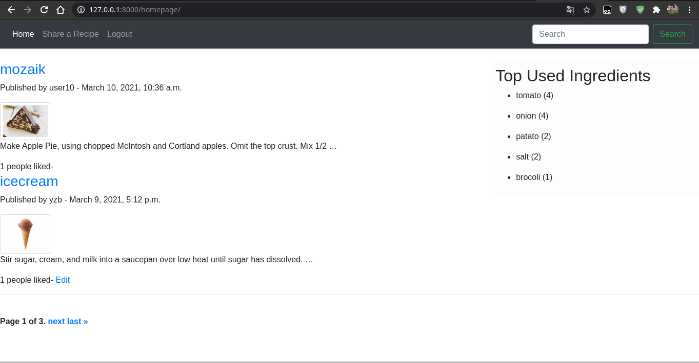

# RecipeMate

## About

An exercise for django/ python



## Project requirements
1) In this project, users will share and search recipes.

2) someone who would like to cook a dish,
may search a recipe.

3) Only registered users can share a recipe. Anonymous users can only consume the
content.

4) The website will store users, recipes, ingredients, likes and ratings in some database and display most used 5
ingredients at the right side of the page.

5) “Like” "Dislike" and “Rate” functionality

## Installation


```bash
$  git clone https://github.com/yz-baskoy/RecipeMate
```

```bash
$ python -m venv env
$ source env/bin/activate
```

```bash
$ pip install -r requirements.txt
```


```bash
$ python manage.py migrate
```
## Usage


```bash
$ python manage.py runserver
```